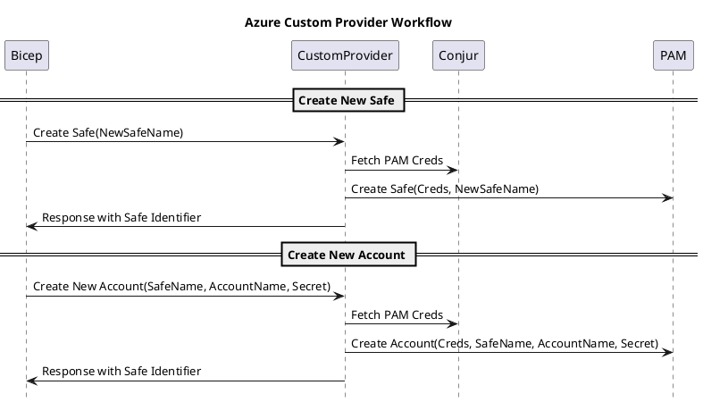

<!-- START doctoc generated TOC please keep comment here to allow auto update -->
<!-- DON'T EDIT THIS SECTION, INSTEAD RE-RUN doctoc TO UPDATE -->

* [Fezzik](#fezzik)
  * [Workflow](#workflow)

<!-- END doctoc generated TOC please keep comment here to allow auto update -->

# Fezzik

## Setup

* Create conjur workload
* Create service acct user in PAM
* Store user credentials in a safe
* Ensure safe is syncronizing to Conjur
* Ensure workload can fetch PAM creds

## Workflow




<!--  -->

## Bootstrap

* TODO: document to configure some stuff
* make bootstrap # this will require logging in with the azure cli
* make clean
* make build
* make publish

## Example Conjur Policies

```bash
.PHONY: load-conjur-policies
load-conjur-policies:
	(cd policies && bash -x ./load-policies.sh)
```

